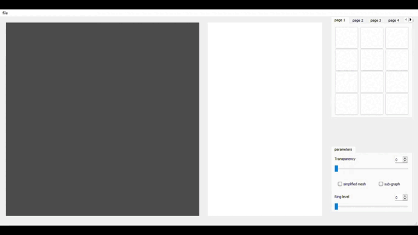
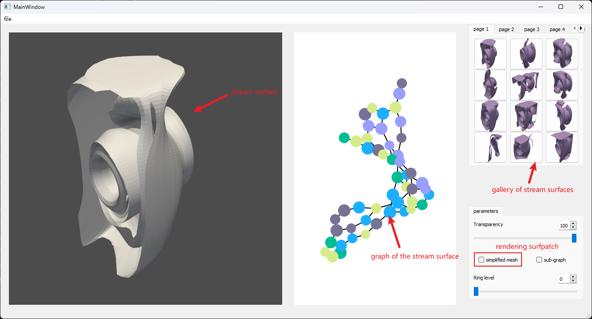
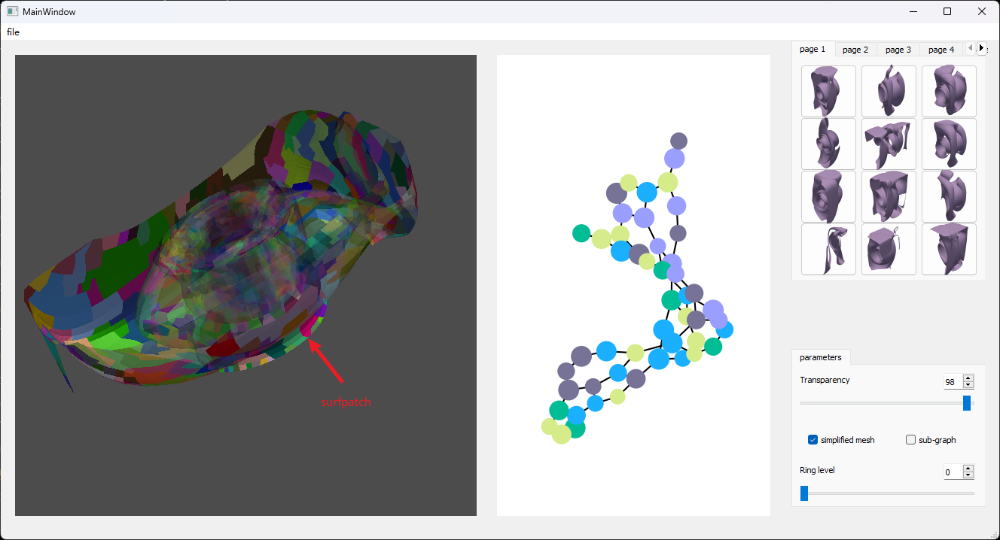

# Surf-Patch
---
## Introduction
> Particles in a 3D flow field form the stream surface. Tornado, Bernard, and two swirls are typical flow data. In this project, we want to use multiple `surfpatches` to characterize stream surface features, cluster these patches by their inherent patterns, and assist domain experts in attaining and analyzing similar surfaces.
---
## Method
> We simplify the stream surface by the `QEM` algorithm. Then transform the stream surface into a graph. The graph node is the surfpatch, and the edge connects the neighboring surfpatches. From the graph, we get multiple sub-graph by a fixed depth and use a `sub-graph contrasting learning` method to obtain the embedding features. These features are projected to a 2D space and clustered by the DBSCAN method.
---
## Results
> Here are the surfpatch and GUI for this project:

